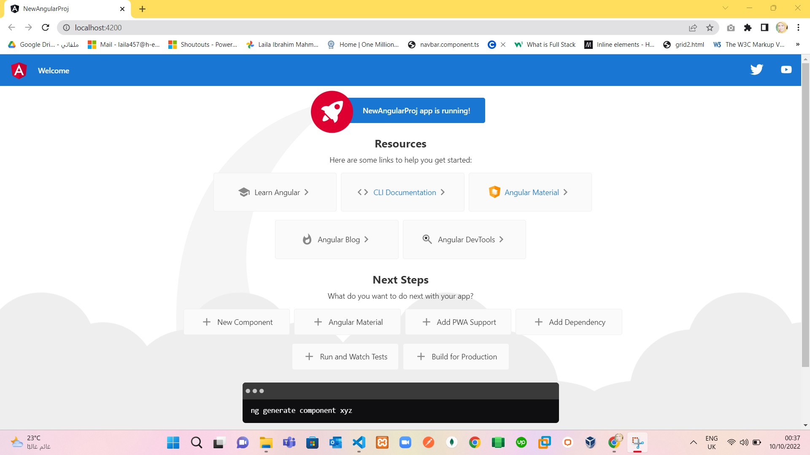
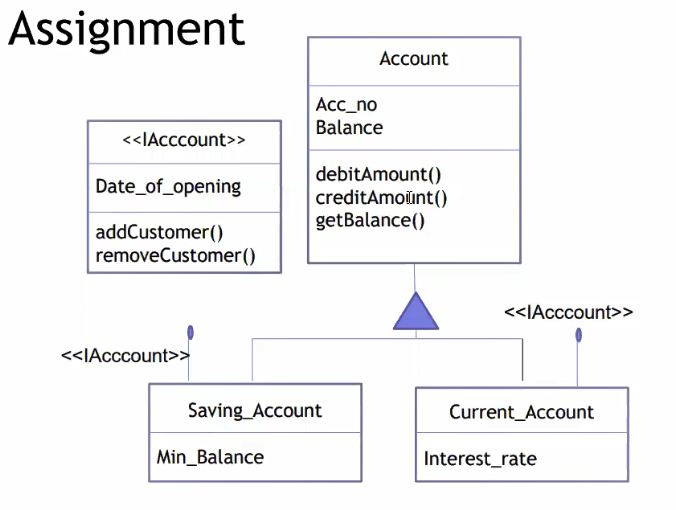

# Lab1 Angular:
# Part 1 : Create new angular project and run it .

> Solve Part 1:
 1. make sure that node and npm on my device by run this commands `node -v` and `npm -v`.
 2. Install typescript -> tsc by run this command `npm i typescript -g`.
 3. Install Angular cli -> ng by run this command `npm i @angular/cli -g`.
 4. To Create New Project by run this command 	`ng new NewAngularProj`. 
 5. run this command to enter in project ` cd NewAngularProj`.
 6. to run angular project, run this command `ng serve --o`.
 7. Finish Part 1 and proj is running as in:
  

# Part 2 : demonstrate UML In code ts and convert it to js as in: 
  

> Solve Part 2:
 1. return Path one step `cd ../` .
 2. create file typescript `main.ts`.
 3. Illustrate UML in:
  
 4. after finish write classes in `main.ts`, run this command in terminal to convert it to js `tsc main.ts`.
 5. to watch all changes ,remove `main.js` and  run this command `tsc main.ts --watch`.
 6. to upgrade to ECMA Script 6 ,remove `main.js` and  run this command `tsc main.ts --watch --target es6`.

